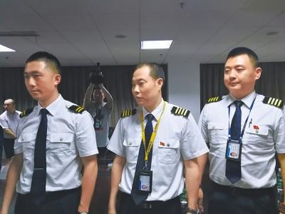
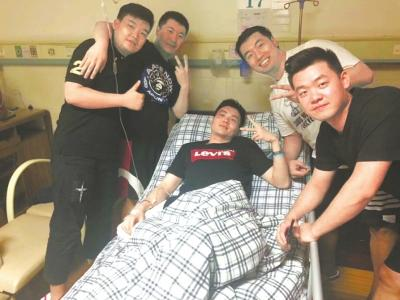
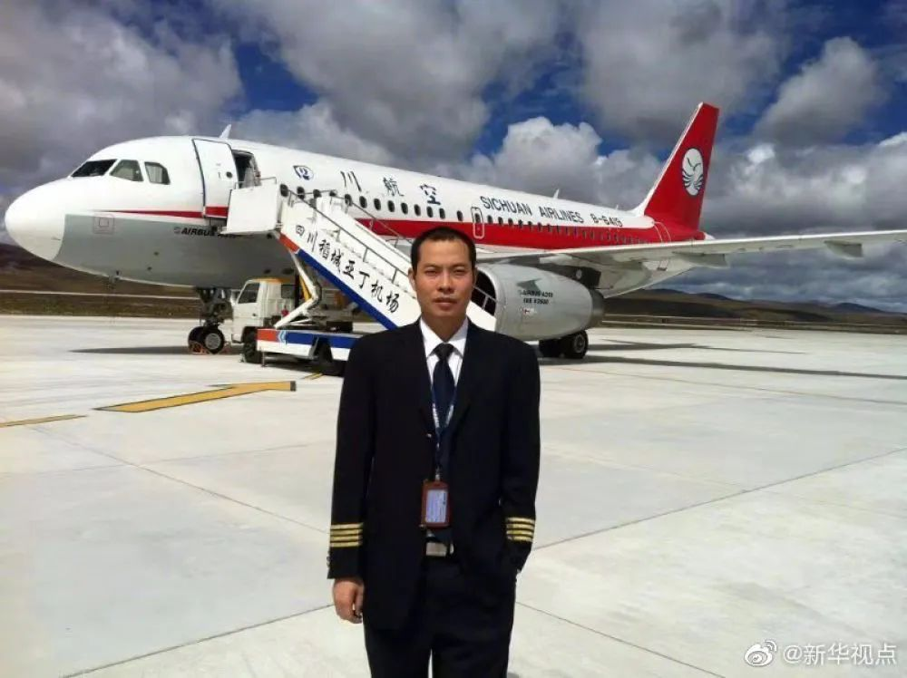
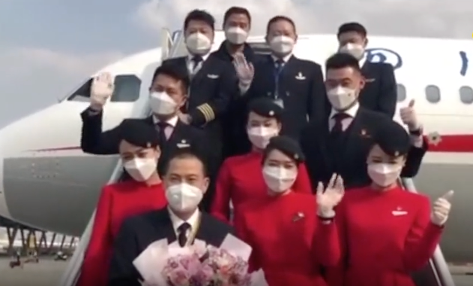

# 🛫 3U8633 —— 一个奇迹

四川航空8633号班机（3U8633）是由四川航空公司运营的中国大陆国内航线航班。该航班2018年5月14日从重庆江北国际机场起飞，执飞机型空中客车A319-100，起飞约40分钟后在32100英尺（约9800米）高度巡航时，驾驶舱右座挡风玻璃破裂脱落，飞机瞬间发生快速减压，正副机长克服低温、大风、噪声、通信困难、机件故障及高高原飞行、紧急下降高度限制等一系列不利因素，最终于事故发生35分钟后将飞机安全降落于成都双流国际机场。该起事故系中国大陆民航史上首个驾驶舱释压事件，也与发生于1990年6月10日的英国航空5390号班机事故极为相似，为民航客机驾驶舱风挡玻璃脱落事故。

> 机长刘传健(中)和3U8633航班机组人员。忻晓松摄

## 事件经过

当天的3U8633航班，机长为刘传健，重庆人，他于2006年加入四川航空至今，在此之前一直在军校飞行（1995年起任空军第二飞行学院飞行教员）。副驾驶为徐瑞辰。执飞机型空中客车A319-100，生产序列号为4660，注册号B-6419，由空中客车公司位于中国天津的总装厂完成，并于2011年7月11日首飞，同年7月26日首次交付给川航，机龄6年10月。截至2018年5月14日，共使用19912.25小时或12920班次。飞机当日无保留故障项目。查询近15日维修记录，该机无风挡故障信息。产生裂纹后破裂脱落的驾驶舱右座前风挡玻璃（件号：STA320-2-7-1）为原装件。

2018年5月14日6时25分，3U8633航班从重庆江北国际机场起飞。

根据网上流传的ATC录音显示，起飞约40分钟后在32100英尺（约9800米）高度巡航过程中，机组发现右侧内风挡出现裂纹，立即申请下高度返航，此时ECAM出现右风挡防冰故障信息。随后，右侧前风挡爆裂。据机长描述，瞬间失压一度将副驾驶徐瑞辰与机长的电子飞行手册吸出，在近万米高空中半个身子都挂在飞机外，所幸他系了安全带，而且爆裂的位置不是侧窗。机组立即按程序处置，期间由于噪音太大无法建立无线电通讯联系，机组将应答机调至7700。因驾驶舱失压，驾驶舱气温降低到零下40多摄氏度，自动驾驶面板完全损坏，仪器多数失灵，自动驾驶完全失灵。由于飞机执飞高原航线，事故发生时正位于四川省阿坝藏族羌族自治州小金县上空，为高山地形，地面高度高于10000英尺（3048米），无法按正常释压处理程序紧急下降至10000英尺可呼吸高度。从Flightradar24提供的飞行数据上可以看出，该航班大约在北京时间早上7:07开始从32000英尺左右紧急下降高度，7:11左右下降至24000英尺（7315米）高度，7:16再度由24000英尺降低高度，7时42分平安着陆在成都双流国际机场。与此同时，客舱内氧气面罩落下，乘务员按程序广播和处置。在民航各保障单位配合下，空管部门给出了半小时“盲发”信号，并开辟空中绿色通道，当地空军也及时叫停十余架准备起飞的军机，将进藏航线以北空域由民航调配。航班在执行超重着陆检查单后全手动进近，于7时46分安全备降在成都双流机场，所有乘客平安落地。

### 时间线

以下均发生在北京时间2018年5月14日。

| 时间 | 经过 |
| -- | -- |
| 06:27:18 | 飞机从重庆江北机场起飞，左座机长刘ⅹ×担任PF，右座副驾驶徐××担任PM，第二机长梁×坐在观察员位置。进入巡航阶段，第二机长梁x作为第三成员在客舱1F座位。 |
| 07:07:05 | 飞至B213航路MIKOS西侧约2NM处，座舱高度6272f，CVR中出现“嘭”的一声闷响，机组发现右风挡玻璃出现放射网状裂纹，机组事后描述为“非常碎非常花，全都裂了”。 |
| 07:07:06 | 副驾驶说“风挡裂了”。 |
| 07:07:06 | ECAM出现“ANTI ICE R WINDSHIELD”信息。 |
| 07:07:07 | 右风档加热功能失效（在DAR中触发了右风档的逻辑值变化）。 |
| 07:07:10 | CVR中第二次出现“嘭”的一声。 |
| 07:07:11 | 机长说“我操作”。 |
| 07:07:19 | 机组向成都区域管制中心(以下简称“区管”)报告飞机故障，申请下高度，区管指挥下8400m保持，机组随后申请返航，报告风挡裂了，决定备降成都。 |
| 07:08:17至07:17:08 | 区管通过多种手段持续呼叫机组，但未收到回应。 |
| 07:10:39 | 空管雷达显示飞机应答机编码设置为7700。 |
| 07:14:25 | MCDU飞行计划更改为直飞崇州（CZH）。 |
| 07:17:09开始 | 区管连续呼叫机组，但未收到回应，区管向机组盲发“如果听到的话联系进近124.85”。 |
| 07:19:25 | 机组在区管频率中宣布MAYDAY。区管均予以回应，但CVR和A1TC录音中未辨识到机组对管制指令的认收。 |
| 07:19:32 | 机组在区管频率中宣布MAYDAY。区管均予以回应，但CVR和A1TC录音中未辨识到机组对管制指令的认收。 |
| 07:20:26 | 机组再次报告：“客舱失压，现在飞向崇州后下4200m”。 |
| 07:20:44 | 区管指挥下降至3600m保持，机组未回应。 |
| 07:22:36 | 飞机位于CZH西侧2.7NM，高度开始低于4800m。 |
| 07:24:20 | 机组在成都终端管制室(以下简称“进近”)频率报告MAYDAY，现在在崇州盘旋下高度。 |
| 07:24:32 | 进近回答:“收到了，当前位置继续右盘旋下高度，下到修正海压2700m，修正海压1004”。 |
| 07:30:14 | 进近呼叫“3U8633，现在使用跑道……可以使用02……”。 | 
| 07:30:17 | 机组盲发“现在左转02R落地”。 |
| 07:37:32 | 进近指令“可以落地02R跑道，风向250，2m/s，RVR大于2000m。” |
| 07:37:45 | 机组报告“塔合，863302R落地，占用跑道”(ATC录音中未听到)。 |
| 07:41:05 | 3U8633使用襟翼3在成都双流机场02R跑道落地。 |
| 07:43:07 | 飞机最后停止在E8与02R跑道连接处。 |
| 07:44:06 | 3U8633与塔台建立联系，机组报告无法自主滑行，有机组、乘务员受伤。 |

## 事件伤亡

副驾驶徐瑞辰面部擦伤、腰部扭伤，右眼有受伤，但均无大碍。乘务员周彦雯因腰部受伤收治入院并于骨科病房接受治疗，副驾驶因皮肤擦伤在急诊科留院观察，其余27名就诊旅客经检查未见明显异常，于5月15日22时前全部结束观察并离院。

> 受伤的副驾驶徐瑞辰(中)。忻晓松摄

## 后续

旅客在工作人员引领下转至候机楼休息，58名旅客并改签至3U8695成都至拉萨航班，于12时09分起飞，并平安到达。

2018年11月16日，在经过为期6个月的康复性检查训练及疗养后，3U8633机组全体成员正式重返蓝天，执飞空客A321顺利完成川航3U8883成都至北京航班。

### 表彰

2018年6月8日下午，中国民用航空局、四川省举行表彰大会，表彰成功处置该次航班险情的川航机组及相关部门的单位和个人。中国民用航空局和四川省决定授予3U8633航班“中国民航英雄机组”称号；授予机长刘传健“中国民航英雄机长”称号，享受省级劳动模范待遇。中国民用航空局和四川省还给予机长刘传健500万元人民币的奖励，给予第二机长梁鹏200万元奖励，给予副驾驶100万元奖励，给予其他6名机组人员100万元奖励。

2018年8月3日上午，“凉山州川航3U8633航班英雄机组事迹报告会”在西昌举行，机长刘传健代表川航3U8633航班机组作报告、发言。

2018年8月7日，机长刘传建经过面试，正式被清华经管学院的清华-ENAC高级管理硕士（航空管理）项目录取。该项目由清华大学和法国国立民航大学合办，旨在培养民航业专业复合型高级管理人才，刘传健将为该项目第5届学员。清华经管学院还将为刘传健提供航空管理硕士项目奖学金。

2018年9月4日，经中华全国总工会正式批复，决定授予四川航空3U8633航班机长刘传健全国五一劳动奖章、四川航空3U8633航班机组“全国工人先锋号”称号。

2018年9月30日，中共中央总书记习近平在国庆69周年招待会上接见了英雄机组。

2018年11月10日，在由中共中央宣传部、国务院退役军人事务部主办的“最美退役军人”学习宣传活动中，机长刘传健获此殊荣（20人之一）。

2019年2月18日，机长刘传健获颁“感动中国2018年度人物”。2019年4月，获选交通运输部“2018感动交通十大年度人物”。

2019年2月27日，四川航空3U8633航班毕楠乘务组荣获全国五一巾帼奖状、全国五一巾帼标兵岗。

2019年9月，机长刘传健被授予“全国敬业奉献模范”荣誉称号。

### 其他

2020年2月2日，四川省第三批援助湖北医疗队医护人员和物资飞赴武汉。担任此次运输执飞任务的机长正是刘传健。

2020年2月9日，四川省第六批援助湖北医疗队伍出征，刘传健再度请缨执飞。起飞前，他来到客舱祝福医护人员工作顺利，并带着大家齐呼“中国加油”、“武汉加油”。

2020年3月21日，四川省第一批、第九批支援湖北医疗队共计313名队员，分别乘坐川航3U3104和3U3103两趟航班抵达成都双流机场。刘传健执飞3U3104航班，亲自把第一批支援湖北医疗队136名队员接回家。

### 相关作品

2018年8月8日，国家电影局发布的7月下旬全国电影剧本（梗概）备案、立项公示显示，博纳影业已备案拍摄电影《中国机长》并获原则上同意，故事改编自3U8633航班事故。影片由刘伟强导演，张涵予、袁泉、李沁、张天爱、杜江、欧豪主演，于2019年9月30日上映。

同时也有很多记录片、访谈。

## 引用

- [https://zh.m.wikipedia.org/zh-cn/%E5...](https://zh.m.wikipedia.org/zh-cn/%E5%9B%9B%E5%B7%9D%E8%88%AA%E7%A9%BA8633%E5%8F%B7%E7%8F%AD%E6%9C%BA%E4%BA%8B%E6%95%85)
- http://www.chinanews.com/sh/2018/05-15/8513738.shtml
- http://www.nbd.com.cn/articles/2020-06-02/1441523.html
- [https://baike.baidu.com/item/5%C...](https://baike.baidu.com/item/5%C2%B714%E5%B7%9D%E8%88%AA%E8%88%AA%E7%8F%AD%E5%A4%87%E9%99%8D%E6%88%90%E9%83%BD%E4%BA%8B%E4%BB%B6/22585196)
